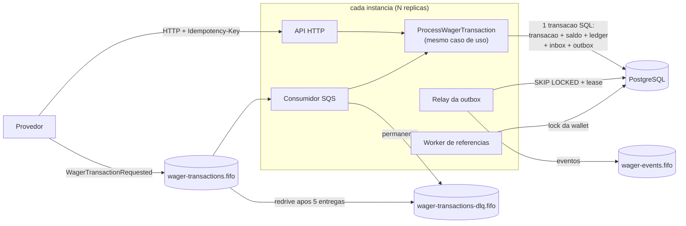
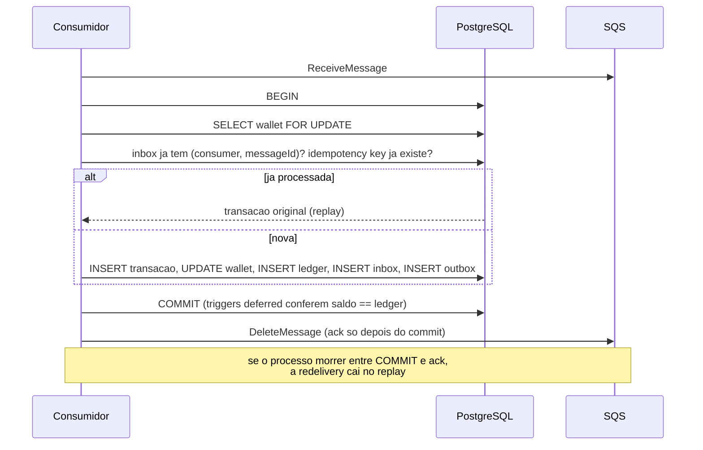

# Arquitetura

Decisoes, trade-offs e limitacoes do processador de apostas. Para subir e testar, ver o [README](README.md).

## Visao geral





## Camadas

```
src/
  domain/          regras puras: sem NestJS, sem ORM, sem relogio, sem I/O
  application/     casos de uso e portas (TransactionRunner, repositorios, Clock, Metrics); sem NestJS nem ORM
  infrastructure/  MikroORM, SQS, relogio, ids: implementam as portas
  interfaces/      HTTP (controllers, filtro de erros, auth), consumidor SQS e ciclo de vida dos workers
  app.module.ts    composicao: o unico lugar que liga portas a implementacoes
```

O dominio recebe ids e horario de fora (`at: Date`, `entryId`, `eventId`). Isso o torna deterministico:
os testes de unidade nao precisam de relogio falso nem de mock.

## Money

- Valor guardado em **`bigint` de centavos**, moeda em ISO-4217. Com escala fixa de 2 casas a representacao e exata;
  `number` nunca participa da conta (o TypeScript recusa misturar `bigint` com `number`).
- Preferido a `decimal.js` porque a escala e fixa: nao ha divisao nem arredondamento no dominio, entao um decimal
  de precisao arbitraria seria dependencia sem uso. Se um dia houver moeda com outra escala (JPY, BHD), a escala
  passa a ser por moeda e a troca fica contida em `Money`.
- Entrada (`Money.from`) aceita `^(0|[1-9]\d{0,17})(\.\d{1,2})?$`: recusa `""`, `NaN`, `Infinity`, notacao
  cientifica, sinal, zero a esquerda, mais de 2 casas e mais de 18 digitos inteiros (o limite de `numeric(20,2)`).
  Menos de 2 casas e aceito e normalizado (`"25.5"` vira `"25.50"`).
- Saida sempre com 2 casas. Valor negativo so existe internamente (`subtract`, `negate`); nunca vem de contrato.
- Operacao entre moedas diferentes lanca `CurrencyMismatchError`.

## Wallet e ledger

- O saldo so muda por `Wallet.debit`/`credit`, e cada chamada **devolve o lancamento** do ledger. Nao ha caminho
  que mude saldo sem lancamento, nem lancamento sem mudar saldo.
- `version` comeca em 1 (abertura, inclusive com o credito OPENING) e sobe 1 por lancamento. O lancamento guarda a
  `walletVersion` que produziu: no banco, `UNIQUE (wallet_id, wallet_version)` transforma o ledger numa corrente
  sem buracos nem duplicatas.
- `WalletLedgerEntry` e estruturalmente imutavel: campos `readonly`, instancia congelada, sem metodo de transicao.
  `create` valida `balanceBefore +/- money == balanceAfter`, valor positivo e saldo nao negativo.
- LOSS e transacoes REJECTED nao geram lancamento.

## WagerTransaction: estados

```
PENDING ──────────► PROCESSED | REJECTED | FAILED
PENDING ──────────► PENDING_REFERENCE
PENDING_REFERENCE ► PENDING_REFERENCE (nova tentativa) | PROCESSED | REJECTED | FAILED
```

PROCESSED, REJECTED e FAILED sao terminais. Tentar transicionar a partir deles lanca `InvalidTransactionStateError`
(erro de programacao, nao de negocio). A liquidacao recusa transacao terminal **antes** de tocar a wallet:
um teste pegou o caso em que a wallet era debitada e so depois a transicao falhava.

A transacao guarda o **saldo observado** na decisao (`observedBalance`). E o que o replay devolve (regra 7),
em vez do saldo atual.

## Regras de negocio

| Operacao | Saldo | Referencia |
|---|---|---|
| BET | debito | nao aceita |
| WIN | credito | opcional, so BET da mesma rodada; valor livre |
| LOSS | nenhum | opcional, so BET; valor pode ser zero |
| REFUND | credito | obrigatoria, so BET, mesmo valor |
| ROLLBACK | inverso da referencia | obrigatoria: BET, WIN ou REFUND, mesmo valor |

A referencia e resolvida por `(providerId, referenceExternalTransactionId)` e precisa ter o mesmo provider,
player, wallet, moeda e rodada.

### Interpretacoes adotadas

- **Uma reversao por referencia, de qualquer tipo.** O enunciado proibe reverter duas vezes "pelo mesmo tipo".
  Seguido a letra, uma BET poderia receber um REFUND e tambem um ROLLBACK, creditando o valor duas vezes.
  Adotei a leitura mais estrita: a BET aceita um unico REFUND **ou** ROLLBACK. Desfazer um REFUND continua possivel
  com um ROLLBACK que referencia o REFUND (outra referencia).
- **Referencia que ainda esta esperando** (ela propria PENDING_REFERENCE) mantem a dependente em espera.
  Referencia REJECTED ou FAILED rejeita a dependente com `REFERENCE_NOT_PROCESSED`.
- **Valor da operacao**: positivo em tudo, exceto LOSS, que pode registrar zero.

### Referencia fora de ordem

Ate 8 verificacoes com atraso de 5s, 10s, 20s ... limitado a 5 min (~15 min no total). Cobre reordenacao e
atraso normais de fila sem deixar a transacao pendurada por horas. Esgotado o limite: REJECTED com
`REFERENCE_NOT_FOUND`. Backoff sem jitter no dominio: quem espalha instancias concorrentes e o `SKIP LOCKED`.

## Codigos de falha

| Codigo | Acao do provedor | Quando |
|---|---|---|
| `INSUFFICIENT_FUNDS` | nova transacao | BET maior que o saldo |
| `REVERSAL_WOULD_OVERDRAW` | desistir | ROLLBACK de credito ja gasto (saldo ficaria negativo) |
| `REFERENCE_NOT_FOUND` | corrigir | referencia nao chegou no prazo |
| `REFERENCE_NOT_PROCESSED` | desistir | referencia foi rejeitada ou falhou |
| `REFERENCE_MISMATCH` | corrigir | referencia de outro player, wallet, moeda ou rodada |
| `INVALID_REFERENCE_KIND` | corrigir | tipo de referencia nao permitido |
| `REFERENCE_ALREADY_REVERSED` | desistir | referencia ja revertida |
| `AMOUNT_MISMATCH` | corrigir | reversao com valor diferente da referencia |
| `CURRENCY_MISMATCH` | corrigir | moeda diferente da wallet |
| `WALLET_PLAYER_MISMATCH` | corrigir | wallet de outro player |
| `PROCESSING_FAILED` | desistir | erro permanente de infraestrutura (FAILED) |

Toda rejeicao e terminal para aquela idempotency key: reenviar devolve a mesma rejeicao. "Nova transacao"
e "corrigir" significam enviar outra operacao, com outro `externalTransactionId`.

## Idempotencia: payloadHash

`payloadHash = SHA-256 (hex minusculo)` do **JSON canonico** dos campos de negocio:
`providerId`, `externalTransactionId`, `playerId`, `walletId`, `roundId`, `gameId`, `kind`, `money`
e `referenceExternalTransactionId` (se houver).

- Chaves ordenadas por code unit, sem espacos, campos ausentes omitidos.
- `money` passa por `Money` antes, entao `"25.5"` e `"25.50"` sao a mesma operacao.
- Header `Idempotency-Key`, `messageId` e outros metadados de transporte ficam fora.

Mesma key com hash diferente e conflito, nunca replay.

## Eventos

Envelope abstrato `IntegrationEvent<T>` com `eventType` e `version` fixos em cada subclasse:
`WagerTransactionProcessed` (inclusive LOSS), `WagerTransactionRejected`, `WagerTransactionPendingReference`
e `WalletBalanceChanged` (so quando o saldo muda). `data` leva `MoneyProps`, nunca `Money`.

`aggregateId` e a **walletId** em todos: e a unidade de concorrencia e o `MessageGroupId` dos eventos
publicados, preservando a ordem por wallet. `OutboxMessage.id` = `eventId`, para o consumidor deduplicar,
ja que a outbox publica pelo menos uma vez.

## Schema: as garantias moram no banco

Migrations escritas a mao em SQL (`src/infrastructure/persistence/migrations/`), executadas pelo Migrator do
MikroORM com lista explicita, cada uma com `up` e `down`. Sem snapshot de diff: constraints, triggers e indices
parciais sao exatamente o que um gerador automatico nao produz. Migracao nova = arquivo novo no fim da lista.

| Garantia | Onde |
|---|---|
| Uma wallet por player + moeda | `UNIQUE (player_id, currency)` |
| Saldo nunca negativo | `CHECK (balance >= 0)` na wallet; `balance_before/after >= 0` no ledger |
| Operacao do provedor unica | `UNIQUE (provider_id, external_transaction_id)` |
| Idempotency key unica | `UNIQUE (provider_id, idempotency_key)`: escopo do provedor, um provedor nao colide com outro |
| Referencia obrigatoria/proibida por tipo | `CHECK` por `kind` |
| OPENING so interno, uma por wallet | `CHECK ((kind = 'OPENING') = (provider_id = 'internal'))` + indice unico parcial |
| Reverter uma referencia uma vez | indice unico parcial `(reference_transaction_id) WHERE status = 'PROCESSED' AND kind IN ('REFUND','ROLLBACK')` |
| Estado terminal definitivo | trigger `BEFORE UPDATE`: terminal nao muda; campos da operacao imutaveis; nada volta a PENDING |
| Coerencia de estado | `CHECK`: failure_code se e so se REJECTED/FAILED; processed_at se e so se terminal; agendamento se e so se PENDING_REFERENCE |
| Aritmetica do lancamento | `CHECK (balance_after = balance_before +/- amount)` |
| Ledger imutavel | trigger que recusa `UPDATE`, `DELETE` e `TRUNCATE` (wallets e transacoes tambem nao se apagam) |
| Ledger sem buraco nem duplicata | `UNIQUE (wallet_id, wallet_version)` + trigger: `balance_before` = `balance_after` da versao anterior |
| Um lancamento por transacao e wallet | `UNIQUE (transaction_id, wallet_id)` |
| Saldo == ultimo lancamento | constraint trigger **deferred** na wallet e no ledger |
| Lancamento so de transacao PROCESSED que move saldo, com valor, moeda e direcao coerentes | constraint trigger deferred no ledger |
| Transacao PROCESSED que move saldo tem lancamento | constraint trigger deferred na transacao |
| Inbox deduplica | `PRIMARY KEY (consumer_name, message_id)` |
| Outbox guarda o envelope do proprio evento | `CHECK (payload->>'eventId' = id AND payload->>'eventType' = event_type)`; conteudo imutavel; publicado e final |

**Por que deferred.** Wallet, transacao e lancamento sao escritos em comandos separados da mesma transacao;
a checagem cruzada so faz sentido quando todos existem. `DEFERRABLE INITIALLY DEFERRED` roda a checagem no
`COMMIT`: se o saldo mudou sem lancamento (ou o contrario), o commit inteiro falha e nada e confirmado.
O custo e uma consulta por indice por linha escrita.

**Dinheiro no banco**: `numeric(20,2)`, moeda em coluna separada. O driver devolve `numeric` como string,
que vai direto para `Money.from` sem passar por `number`.

**Limitacao conhecida**: as triggers de imutabilidade valem ate para o dono das tabelas, mas um superusuario
pode desliga-las. Em producao, a aplicacao usaria um papel sem `TRIGGER`/`TRUNCATE` e as migrations, outro.

Os testes de integracao (`test/integration/schema.test.ts`) violam cada linha desta tabela direto em SQL,
sem passar pelo dominio, e provam que `down` total remove tudo e `up` recria.

## ORM: MikroORM e mapeamento

- **MikroORM 7** (preferencial no enunciado): Unit of Work e Identity Map explicitos, `em.transactional()` e
  `LockMode.PESSIMISTIC_WRITE`.
- Mapeamento por `EntitySchema`, sem decorators, sobre **registros de persistencia** (`records.ts`) separados das
  classes de dominio. Os mapeadores (`mappers.ts`) reidratam o dominio com `rehydrate` e copiam o estado de volta.
  Assim o dominio nao tem construtor publico, decorator nem tipo do ORM.
- **Money no banco**: `numeric(20,2)` lido pelo `DecimalType` em modo string. A string vai direto para `Money.from`.
  Valor e moeda em colunas separadas.
- As relacoes (`wallet`, `transaction`, `referenceTransaction`) estao declaradas so para o Unit of Work ordenar os
  INSERTs no flush (wallet -> transacao -> lancamento). O dominio continua falando em ids.

## Estrategia transacional e concorrencia

**Unidade de concorrencia: a wallet.** O caso de uso `ProcessWagerTransaction` (o mesmo para HTTP e SQS):

1. **Caminho rapido sem lock**: procura a idempotency key. Se existir, e replay ou conflito, sem transacao de escrita.
2. Abre a transacao (READ COMMITTED) e trava a wallet: `SELECT ... FOR UPDATE` (`lockById`).
3. **Com o lock na mao, confere a idempotencia de novo.** Quem esperou pelo lock ve o que o anterior confirmou e
   responde replay. E isso que faz 50 envios simultaneos da mesma aposta resultarem num unico debito.
4. Resolve a referencia, aplica as regras do dominio e registra transacao, saldo, lancamento, inbox e eventos.
5. Um unico flush e COMMIT. As constraint triggers deferred conferem saldo == ledger nesse momento.

**Por que lock pessimista e nao otimista.** Numa wallet disputada (muitas apostas do mesmo jogador), lock otimista
vira tempestade de retry: todos leem a versao N e so um grava. Com `FOR UPDATE`, a fila se forma no Postgres, cada
operacao espera a vez uma unica vez e nao ha retry. O lock e de uma linha, entao wallets diferentes nao se
bloqueiam (testado), e funciona igual com qualquer numero de instancias, porque quem coordena e o banco. Cada
transacao trava uma unica wallet, entao nao ha ordem de lock a respeitar e nao ha deadlock entre wallets.

**`version`** continua existindo e sobe a cada mudanca de saldo, mas nao e o mecanismo de controle: serve de
corrente do ledger (`UNIQUE (wallet_id, wallet_version)`), que e outra barreira contra lost update.

**Corridas que o lock nao cobre** (a mesma key enviada para wallets diferentes, duas criacoes da mesma wallet) sao
decididas pelos indices unicos. O perdedor recebe `UniqueViolationError`, o caso de uso tenta mais uma vez e cai
no replay ou no conflito, como uma requisicao normal.

**Espera limitada**: `SET LOCAL lock_timeout` (5 s, configuravel). Esgotado, a resposta e 503 com `Retry-After`,
sem efeito parcial. O SQLSTATE 55P03 e classificado direto: o MikroORM o entrega como excecao generica, e sem isso
o provedor receberia 500 e nao saberia que pode reenviar.

**Reconciliacao** le wallet e ledger no mesmo snapshot (REPEATABLE READ, somente leitura), para um lancamento
confirmado no meio da conta nao gerar falsa divergencia.

## Idempotencia: fluxo

| Situacao | Resultado |
|---|---|
| Key nova | processa |
| Key existente, mesmo `payloadHash` | replay: mesmo corpo, `idempotentReplay: true`, saldo daquele momento |
| Key existente, hash diferente | 409 `IDEMPOTENCY_CONFLICT` |
| `(providerId, externalTransactionId)` existente com outra key | 409 `IDEMPOTENCY_CONFLICT` |
| Mensagem SQS ja recebida (inbox) | replay da transacao registrada |
| Mesmo `messageId` com conteudo diferente | `MESSAGE_ID_CONFLICT` (mensagem invalida, vai para a DLQ) |

Tudo persistente no Postgres; nada depende de memoria do processo.

## API HTTP: status

| Situacao | Status | Corpo |
|---|---|---|
| Transacao processada | 201 | `{ transactionId, status, balance, idempotentReplay: false }` |
| Replay de processada | 200 | o mesmo, com `idempotentReplay: true` |
| Aceita aguardando referencia | 202 | `status: PENDING_REFERENCE` |
| Rejeitada por regra de negocio (e seu replay) | 422 | `status: REJECTED`, `failureCode` |
| Payload invalido, header ausente, JSON malformado | 400 | `error.code = VALIDATION_FAILED`, `details` por campo |
| Conflito de idempotencia | 409 | `IDEMPOTENCY_CONFLICT` |
| Wallet duplicada | 409 | `WALLET_ALREADY_EXISTS` |
| Wallet ou transacao inexistente | 404 | `WALLET_NOT_FOUND` / `TRANSACTION_NOT_FOUND` |
| Falha transitoria (banco fora, lock timeout, deadlock) | 503 + `Retry-After` | `TEMPORARILY_UNAVAILABLE` |
| Erro inesperado | 500 | `INTERNAL_ERROR` |

Erros sempre como `{ "error": { "code", "message", "details"? } }`. A regra pratica para o provedor:
**503 reenvia igual; 4xx nao reenvia igual.** Os endpoints GET seguem os mesmos codigos.

## Autenticacao

**Nao implementada**: vale zero pontos e competiria com o que vale. O ponto de extensao esta no codigo:

- `ProviderIdentityPort` (`src/interfaces/http/auth.ts`) resolve a identidade de quem chama. Hoje a implementacao e
  `UnauthenticatedProviderIdentity`, que nao afirma provedor nenhum.
- `ProviderAuthGuard` e global. Health checks sao `@Public()`.
- `assertActsAsProvider` ja compara o provedor autenticado com o `providerId` do corpo e da rota (403
  `PROVIDER_MISMATCH`). Com a implementacao no-op, nunca dispara.

**Desenho adotado se fosse implementar**: Keycloak no compose, um client confidencial por provedor com
`client_credentials`, e uma claim `provider_id` no access token. A implementacao do port validaria o JWT (assinatura
pelo JWKS do realm, `iss`, `aud`, `exp`) e devolveria `provider_id`. Mensagens da fila sao canal interno confiavel,
mas o `providerId` delas passa pelas mesmas validacoes de dominio.

## Processos e workers

Um unico binario. Cada instancia roda a API e, conforme `WORKERS` (padrao: todos), os workers:

| Worker | O que faz | Concorrencia entre instancias |
|---|---|---|
| `consumer` | le `wager-transactions.fifo` (long polling) | o SQS entrega cada mensagem a um consumidor por vez; a inbox cobre a redelivery |
| `outbox` | publica eventos pendentes em `wager-events.fifo` | `FOR UPDATE SKIP LOCKED` + lease |
| `references` | reavalia transacoes `PENDING_REFERENCE` vencidas | lock da wallet + releitura sob o lock |

Os workers sobem em `onApplicationBootstrap` e param em `beforeApplicationShutdown`, **antes** de o banco e o
cliente SQS serem fechados (`onApplicationShutdown`).

## Consumidor SQS

- Usa **o mesmo** `ProcessWagerTransaction` do HTTP. A inbox `(consumerName, messageId)` e gravada no mesmo COMMIT
  do efeito financeiro. **O ack (`DeleteMessage`) so acontece depois do commit.**
- `messageId` e o do envelope (do provedor), estavel entre redeliveries e republicacoes. O `payloadHash` da inbox e o
  SHA-256 do envelope canonico: mesmo `messageId` com outro conteudo nao e redelivery, vai para a DLQ.
- Ordem: dentro do lote, cada `MessageGroupId` (walletId) e processado em sequencia, e grupos diferentes em paralelo.
  Se uma mensagem do grupo falha, as seguintes do mesmo grupo voltam para a fila (visibilidade 0) para nao passarem
  na frente.

| Falha | Exemplos | O que acontece |
|---|---|---|
| **negocio** (terminal) | wallet inexistente, conflito de idempotencia | ack + log + metrica |
| **permanente** | JSON invalido, tipo desconhecido, payload invalido, `messageId` reusado | envia para a DLQ com o motivo nos atributos, depois ack |
| **transitoria** | banco fora, lock timeout, erro desconhecido | sem ack; `ChangeMessageVisibility` com backoff exponencial (2 s .. 60 s) |

Transitoria repetida: depois de `maxReceiveCount` (5) entregas, o **redrive da propria fila** move para a DLQ. Erro
inesperado e tratado como transitorio de proposito: tenta algumas vezes antes de desistir.

Rejeicao de negocio **ja registrada** (ex.: `INSUFFICIENT_FUNDS`) nao e falha: a transacao fica `REJECTED`, o evento
sai pela outbox e a mensagem e confirmada.

**Crash entre commit e ack**: a mensagem volta quando a visibilidade vence; a inbox (ou a idempotency key) reconhece
e responde replay; o ack acontece. Nenhum efeito duplicado. Testado em processo (`SimulatedCrash`); o teste com o
processo morto de verdade por SIGKILL (`FAULT_INJECTION=crash-after-commit`, so em teste) fica na suite multi-processo.

**SIGTERM**: para de buscar (o long polling e abortado), termina as mensagens ja iniciadas (commit + ack) e devolve
as que nao comecaram com visibilidade 0, para outra instancia pegar na hora.

## Outbox

1. O evento e gravado na mesma transacao do efeito. Nada e publicado antes do COMMIT.
2. O relay **reivindica** um lote: `UPDATE ... SET locked_by, locked_until WHERE id IN (SELECT ... FOR UPDATE SKIP
   LOCKED)`. Dois publicadores no mesmo instante pegam lotes disjuntos (testado).
3. Publica com `SendMessageBatch`: `MessageGroupId = walletId`, `MessageDeduplicationId = eventId`.
4. Marca `published_at` **so se o lease ainda for dele**. Falha de publicacao: `attempts + 1`, `next_attempt_at`
   com backoff (1 s .. 60 s, sem limite: evento confirmado nao se perde), lease liberado.

**Processo morre depois do commit e antes de publicar**: o evento continua pendente no banco; quando o lease vence
(30 s), qualquer instancia publica. **Publicacao duplicada** (publicou e morreu antes de marcar) e segura: o
`eventId` e estavel, o SQS FIFO deduplica em 5 min e o consumidor deve deduplicar por `eventId`.

**Limitacao**: com varios publicadores, eventos da mesma wallet podem sair fora de ordem entre lotes diferentes. O
consumidor ordena por `walletVersion` (em `WalletBalanceChanged`) e `occurredAt`. Ordem estrita exigiria reivindicar
por wallet, ao custo de paralelismo.

## Referencias fora de ordem: worker

- A transacao fica `PENDING_REFERENCE` com `next_reference_check_at`. O worker varre as vencidas (indice parcial),
  trava a wallet, **rele a transacao sob o lock** e so entao decide. Varios workers concorrentes aplicam uma vez so
  (testado com 5).
- Quando a referencia chega, `expediteWaitingFor` antecipa a verificacao das dependentes para "agora": nao e preciso
  esperar o backoff.
- Esgotadas as tentativas (8, ~15 min): `REJECTED` com `REFERENCE_NOT_FOUND` e `WagerTransactionRejected`.

## Observabilidade

### Logs

Uma linha JSON por evento (`time`, `level`, `context`, `message`). Os ids de correlacao entram **sozinhos** em toda
linha emitida durante uma requisicao ou mensagem, via `AsyncLocalStorage` (`application/log-context.ts`):

| Campo | Quem coloca |
|---|---|
| `correlationId` | header `x-correlation-id` (ou gerado; devolvido na resposta); `correlationId` do envelope SQS |
| `messageId` | consumidor SQS, por mensagem |
| `providerId`, `walletId` | caso de uso, ao receber o comando |
| `transactionId` | caso de uso, ao decidir; worker de referencias |

Cada requisicao gera uma linha de acesso (`message: "http"`, rota como template, status, duracao) e cada mensagem SQS
gera `"mensagem processada"` com o desfecho. **Nada de valor financeiro ou payload**: o logger mascara `money`,
`amount`, `balance`, `payload`, `body` e `authorization`, mesmo que alguem os passe por engano (testado). Os logs do
proprio NestJS saem no mesmo formato.

### Metricas (`GET /metrics`, formato Prometheus, aberto como os health checks)

Catalogo tipado em `application/metrics-catalog.ts`: a porta `Metrics` nao aceita nome nem rotulo fora dele. Rotulos
de cardinalidade baixa e conhecida (nunca ids). Cada instancia tem o rotulo `instance_id`.

| Exigencia | Metrica |
|---|---|
| Transacoes por status | `wager_transactions_total{kind,status}`, `pending_reference_transactions` |
| Duplicatas detectadas | `wager_duplicates_total{source}`, `sqs_messages_total{result="duplicate"}` |
| Retries | `sqs_retries_total`, `wager_unique_race_retries_total`, `outbox_publish_failures_total` |
| Mensagens em DLQ | `sqs_dlq_messages` (profundidade real da DLQ), `sqs_dlq_total{reason}` |
| Conflitos de lock | `wallet_lock_wait_seconds` (tempo na fila da wallet), `wallet_lock_timeouts_total` |
| Outbox lag | `outbox_lag_seconds` (idade do evento pendente mais antigo), `outbox_pending_events` |
| Latencia de processamento | `wager_processing_seconds{source,status}`, `sqs_processing_seconds`, `http_request_duration_seconds` |
| Reconciliacao | `reconciliations_total{result}`, `reconciliation_divergences_total` |

Os gauges de estado (outbox, pendencias, DLQ) sao lidos **na hora do scrape**, do banco e do SQS: refletem o sistema
inteiro, nao a memoria de uma instancia. Se a fonte falhar, o gauge vira `NaN` sem derrubar o scrape.

### Health checks

`/health/live` nao toca dependencias (falha = reiniciar o processo). `/health/ready` checa PostgreSQL e SQS com prazo
de 2 s cada (falha = tirar do balanceador). Ambos sem autenticacao.

## Entrega

- `docker compose --profile app up -d --build` (ou `bun run stack:up`) sobe tudo: Postgres, MiniStack, criacao das filas,
  migrations, **1 API** (porta 3000, sem workers) e **3 workers** (consumidor, relay e referencias). E o cenario de
  varias instancias concorrentes rodando de fato.
- A imagem roda o TypeScript direto no Bun (sem etapa de build) com dependencias de producao, usuario sem
  privilegio e `HEALTHCHECK` no `/health/ready`. No `docker stop`, o SIGTERM chega ao Bun (PID 1), os workers param e o
  processo sai com 0.
- O CI tem dois jobs: `test` (typecheck + todos os testes com Postgres e SQS reais) e `stack` (sobe a pilha acima e
  roda `bun run smoke`: HTTP, replay, 3 mensagens pela fila consumidas pelos workers, reconciliacao e outbox vazia).

## Trade-offs e limitacoes

| Decisao / limite | Por que | Custo |
|---|---|---|
| Lock pessimista por wallet | sem tempestade de retry em wallet quente; coordenacao no banco, vale para N instancias | operacoes da mesma wallet sao serializadas: o teto de uma wallet e ~1 / duracao da transacao |
| Checagem saldo == ledger por constraint trigger deferred | a garantia vale para qualquer escrita, nao so para este codigo | uma consulta por indice extra por linha escrita no COMMIT |
| Uma reversao por referencia, de qualquer tipo | evita creditar duas vezes uma BET (REFUND + ROLLBACK) | mais estrito que a letra do enunciado ("pelo mesmo tipo") |
| `FAILED` modelado, mas nao produzido | transitorio e retentado; mensagem com erro permanente vai para a DLQ antes de existir transacao gravada | o estado existe (transicoes, constraints, `PROCESSING_FAILED`) para um caminho que hoje nao ocorre |
| Outbox pelo menos uma vez | lease + SKIP LOCKED: nada se perde com instancia morta | evento pode sair duas vezes (consumidor deduplica por `eventId`); com varios publicadores, ordem por wallet nao e estrita |
| Inbox sem limpeza | a idempotency key ja e a garantia final; a inbox protege o `messageId` | a tabela cresce; em producao, retencao por idade (a redelivery do SQS nao passa de 14 dias) |
| Triggers de imutabilidade | valem ate para o dono das tabelas | um superusuario pode desliga-las; em producao, papeis separados para aplicacao e migrations |
| Autenticacao nao implementada | vale zero pontos | ponto de extensao e desenho Keycloak documentados acima |
| Uma unica moeda testada de ponta a ponta (BRL) | permitido pelo enunciado | o modelo e multi-moeda (`UNIQUE (player_id, currency)`) e o conflito de moeda e testado; escala fixa de 2 casas |
| MiniStack no lugar do LocalStack | o SQS do LocalStack Community virou pago | emulador menos difundido; FIFO, dedup, visibilidade e redrive foram verificados antes de adotar |

## Falhas eliminatorias: como cada uma e evitada

| Falha eliminatoria | Como e evitada | Prova |
|---|---|---|
| `number` para dinheiro | `Money` em `bigint`; `numeric(20,2)` lido como string; `number` recusado na entrada | `money.test.ts`, `api.test.ts` ("valor como number" = 400) |
| Saldo negativo por race | `FOR UPDATE` na wallet + `CHECK (balance >= 0)` + checagem no dominio | `concurrency.test.ts`, `cluster.test.ts` (wallet quente, 100 / 80 / 80), `schema.test.ts` |
| Debito ou credito duplicado | idempotencia conferida sob o lock + `UNIQUE` de key e operacao + inbox + reversao unica por indice | 50x a mesma aposta (1 e 3 processos), redelivery, crash entre commit e ack |
| Idempotencia so em memoria | tudo em tabela com indice unico | `wagering.test.ts` ("outro processo ve o replay"), `cluster.test.ts` |
| Correto so com uma instancia | coordenacao no Postgres (lock de linha, `SKIP LOCKED`, indices unicos), nada em memoria | `cluster.test.ts` (3 processos), job `stack` do CI (1 API + 3 workers) |
| Evento publicado antes do commit | so a outbox grava eventos, na mesma transacao; o relay le o que foi confirmado | `outbox-and-references.test.ts` (commit, processo morre, outra instancia publica) |
| Ledger nao auditavel | lancamento imutavel por trigger, com `balance_before`/`after` e corrente por versao; reconciliacao | `schema.test.ts`, reconciliacao em todos os testes de integracao |
| Testes que trocam Postgres e SQS por mock | integracao e multi-processo sempre contra Postgres e MiniStack reais, banco e filas proprios por arquivo | `test/support/database.ts`, `test/support/queues.ts` |
